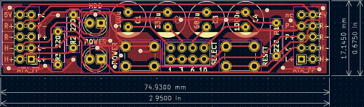
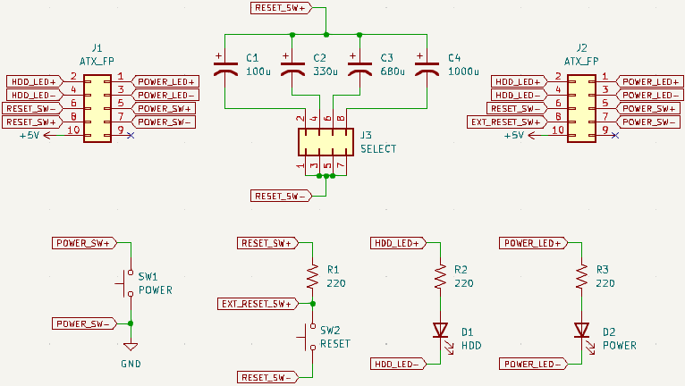
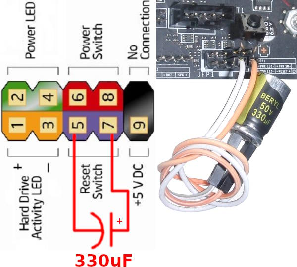
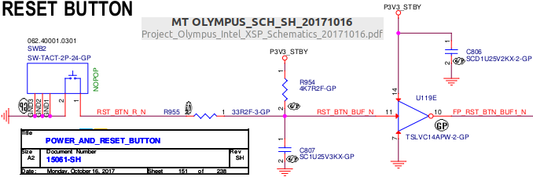
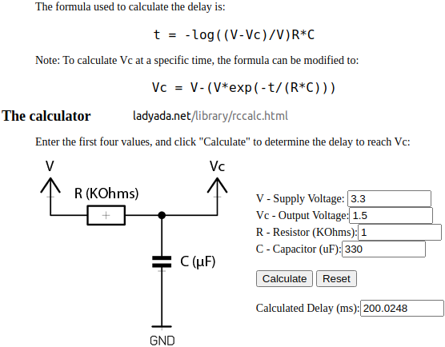
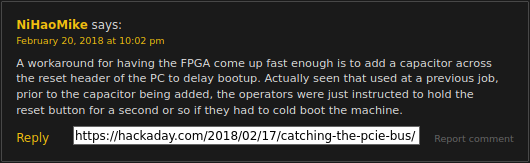

**Work-In-Progress**: [Gerbers complete](https://github.com/mwrnd/ATX_Boot_Delay/releases/tag/v0.1-alpha) but not yet ordered.

# ATX Boot Delay

Delaying BIOS boot is a simple trick that solves some PCIe issues. You can do this by pressing the POWER button, then pressing and holding the RESET button for a second before releasing it. Or, connect a capacitor across the reset pins of an ATX motherboard's [Front Panel Header](https://www.intel.com/content/www/us/en/support/articles/000007309/intel-nuc.html).

This board is a simple Front Panel replacement for ATX motherboards that allows choosing capacitor(s) to connect accross the RESET pins and delay boot.

## PCB Layout

## Schematic

## Bill Of Materials

| Designator(s) | Part Number             | Quantity | Value   | Footprint                         | Availability                                                                                                |
| ------------- | ----------------------- | -------- | ------- | --------------------------------- | ----------------------------------------------------------------------------------------------------------- |
| C1            | 860010674014            |        1 | 100uF   | C_Radial_D8.0mm_H11.5mm_P3.50mm   | [DigiKey](https://www.digikey.com/en/products/detail/w%C3%BCrth-elektronik/860010674014/5726913)            |
| C2            | 860010374011            |        1 | 330uF   | C_Radial_D8.0mm_H11.5mm_P3.50mm   | [DigiKey](https://www.digikey.com/en/products/detail/w%C3%BCrth-elektronik/860010374011/5726852)            |
| C3            | 860020274013            |        1 | 680uF   | C_Radial_D8.0mm_H11.5mm_P3.50mm   | [DigiKey](https://www.digikey.com/en/products/detail/w%C3%BCrth-elektronik/860020274013/5727150)            |
| C4            | 860010274015            |        1 | 1000uF  | C_Radial_D8.0mm_H11.5mm_P3.50mm   | [DigiKey](https://www.digikey.com/en/products/detail/w%C3%BCrth-elektronik/860010274015/5726956)            |
| SW1, SW2      | TS02-66-60-BK-100-LCR-D |        2 | N/A     | SW_PUSH_6mm                       | [DigiKey](https://www.digikey.com/en/products/detail/cui-devices/TS02-66-60-BK-100-LCR-D/15634327)          |
| J1            | PREC005DBAN-M71RC       |        1 | N/A     | PinSocket_2x05_P2.54mm_Horizontal | [DigiKey](https://www.digikey.com/en/products/detail/sullins-connector-solutions/PREC005DBAN-M71RC/2775649) |
| J2            | PPTC052LJBN-RC          |        1 | N/A     | PinHeader_2x05_P2.54mm_Horizontal | [DigiKey](https://www.digikey.com/en/products/detail/sullins-connector-solutions/PPTC052LJBN-RC/775977)     |
| J3            | 9-146257-0-04           |        1 | N/A     | PinHeader_2x04_P2.54mm_Vertical   | [DigiKey](https://www.digikey.com/en/products/detail/te-connectivity-amp-connectors/9-146257-0-04/1165365)  |
| D1            | C503B-RAN-CZ0C0AA2      |        1 | RED     | LED_D5.0mm                        | [DigiKey](https://www.digikey.com/en/products/detail/creeled-inc/C503B-RAN-CZ0C0AA2/6561762)                |
| D2            | LTL-4234                |        1 | GREEN   | LED_D5.0mm                        | [DigiKey](https://www.digikey.com/en/products/detail/liteon/LTL-4234/200373)                                |
| R1, R2, R3    | CF14JT220R              |        1 | 220-Ohm | R_Axial_DIN0207_L6.3mm_D2.5mm     | [DigiKey](https://www.digikey.com/en/products/detail/stackpole-electronics-inc/CF14JT220R/1741346)          |
| Jumpers       | QPC02SXGN-RC            |        4 | N/A     | N/A                               | [DigiKey](https://www.digikey.com/en/products/detail/sullins-connector-solutions/QPC02SXGN-RC/2618262)      |

## Theory of Operation

The capacitor across RESET works thanks to an [RC Delay](https://en.wikipedia.org/wiki/RC_time_constant) on the reset signal buffer. The [OpenCompute](https://en.wikipedia.org/wiki/Open_Compute_Project) project has a public schematic and the RESET Button is on Pg#151 in *Project_Olympus_Intel_XSP_Schematics_20171016.pdf* found in [`Project_Olympus_Intel_XSP_Collateral.zip`](http://files.opencompute.org/oc/public.php?service=files&t=e969672c57d6e17647adea54f2c3e5a7&download).

A standard Schmitt-Trigger inverter such as the [SN74LVC1G14](https://www.ti.com/lit/gpn/SN74LVC1G14) has a positive-going threshold voltage of about 1.5V with a 3.3V supply. I have measured 1k-Ohm between the RESET+ pin and the 3.3V ATX Power supply rail. A 330uF capacitor therefore delays boot by about 200ms. [RC Calculator](http://ladyada.net/library/rccalc.html):

I found out about this technique [here](https://hackaday.com/2018/02/17/catching-the-pcie-bus/):

